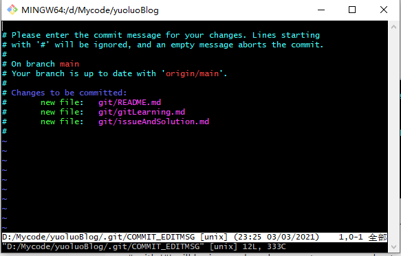

#### 输入了 git commit 命令进入另外一个页面。查看 gitCommitPage.PNG图片

    遇到信息：
        please enter a commit message to explain why this merge is necessary,
        especially if it merges an updated upstream into a topic branch.
        lines starting with '#' will be ignored,
        and an empty message aborts the commit
    解决办法：
        1.按键盘上的i键进入insert模式
        2.修改最上面黄色选中的信息，可以选择不修改
        3.按esc键离开界面
        4.输入:wq,(冒号+wq)按回车键
    

    